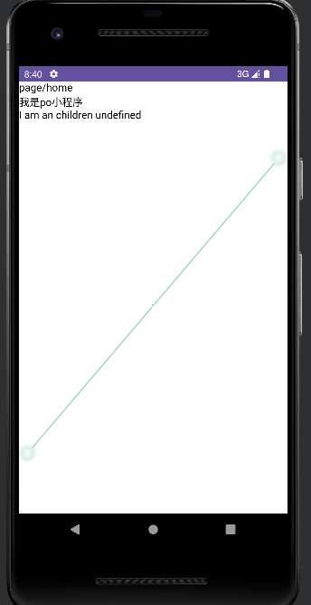

# po
小程序技术，模仿微信小程序,此项目可以了解小程序是如何实现的。

## 主要特点
1. view 和 js 编译成独立两套
2. view 可运行在浏览器，electron 的webview等
3. js 运行在node下
4. view 和 js 通过bridge通信

### 涉及知识点
1. 虚拟DOM
2. 编译相关知识, ast/code-gen等等
3. 等等...

### 项目结构
1. dsbridge:抽象bridge功能，供webview/js通信
2. runtime-jscore: po框架的js运行时部分
3. runtime-webview: webview运行时部分
4. server: 服务端运行部分，提供webview和jscore的代码下载，供native运行
5. android：android app 运行示例

### demo演示
1. npm run build
2. node test/test.js
3. 打开android目录下的工程，运行

### android studio 预览效果图
